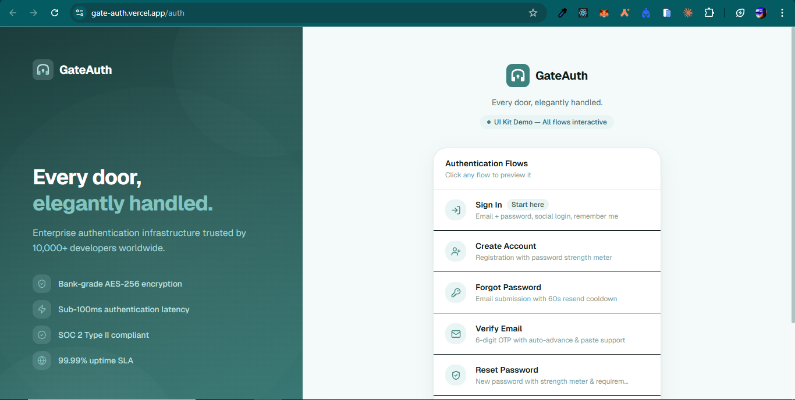

# GateAuth — Every door, elegantly handled.

> A production-grade Authentication UI Kit built with Next.js 16, TypeScript, and Tailwind CSS v4.



---

## Overview

GateAuth is a fully-featured, pixel-perfect authentication UI kit designed to serve as a solid foundation for any modern SaaS, web application, or enterprise product that requires a secure and polished sign-in experience. Built by a developer with deep experience in authentication systems, GateAuth goes beyond a simple login form — it covers the complete authentication lifecycle: account creation, email verification, password recovery, and secure password reset, all wrapped in a cohesive, branded design system.

The project was built with a clear philosophy: authentication is the first thing your users see, and it should inspire trust. Every screen has been crafted with attention to UX detail — real-time validation feedback, accessible keyboard navigation, loading and error states, responsive layouts that work flawlessly from 320px mobile screens to wide desktop displays, and a calm teal color palette that communicates security and professionalism without being cold or clinical.

GateAuth is not a backend — it is a UI kit. All form submissions simulate async API calls, making it trivial to wire up to any authentication provider (NextAuth.js, Supabase, Auth0, Clerk, custom JWT, etc.) with minimal changes.

---

## Screenshot


---

## Features

- **5 complete auth flows** — Login, Sign Up, Forgot Password, Email Verification (OTP), Reset Password
- **Split-screen layout** — Branded left panel with feature highlights + clean right form panel
- **Live Zod validation** — Field-level and form-level errors with clear, actionable messages
- **Password strength meter** — 4-level animated indicator with contextual guidance
- **6-digit OTP input** — Auto-advance on digit entry, backspace navigation, full paste support
- **60-second resend cooldown** — Countdown timer on email resend for both OTP and password reset
- **Social login buttons** — Google and GitHub (UI only, ready to wire up)
- **All form states handled** — Idle, loading (spinner), success, error
- **Token-expired error state** — Friendly full-page message with recovery CTA
- **Fully responsive** — Mobile-first, 44px minimum tap targets, tested from 320px to 1920px
- **Accessible** — ARIA labels, roles, keyboard navigable, visible focus rings
- **Zero TypeScript errors** — Strict mode throughout

---

## Tech Stack

| Technology | Version | Purpose |
|---|---|---|
| [Next.js](https://nextjs.org) | 16.x | Framework (App Router) |
| [TypeScript](https://typescriptlang.org) | 5.x | Type safety (strict mode) |
| [Tailwind CSS](https://tailwindcss.com) | 4.x | Styling & design tokens |
| [React Hook Form](https://react-hook-form.com) | 7.x | Form state management |
| [Zod](https://zod.dev) | 4.x | Schema validation |
| [Lucide React](https://lucide.dev) | latest | Icons |
| [Sonner](https://sonner.emilkowal.ski) | 2.x | Toast notifications |
| [Geist](https://vercel.com/font) | latest | Typography (Sans + Mono) |

---

## Project Structure

```
gateauth/
├── app/
│   ├── auth/
│   │   ├── layout.tsx              # Split-screen auth layout
│   │   ├── page.tsx                # Flow navigator (demo index)
│   │   ├── login/page.tsx
│   │   ├── signup/page.tsx
│   │   ├── forgot-password/page.tsx
│   │   ├── verify-email/page.tsx
│   │   └── reset-password/page.tsx
│   ├── globals.css                 # Design tokens + animations
│   └── layout.tsx                  # Root layout with Toaster
├── components/
│   └── auth/
│       ├── AuthCard.tsx            # Card wrapper
│       ├── AuthInput.tsx           # Input + label + error
│       ├── AuthDivider.tsx         # "or" divider
│       ├── FormError.tsx           # Global error banner
│       ├── GateAuthLogo.tsx        # SVG logo + wordmark
│       ├── LoadingButton.tsx       # Button with spinner
│       ├── OTPInput.tsx            # 6-digit OTP input
│       ├── PasswordInput.tsx       # Password + show/hide toggle
│       ├── PasswordStrengthMeter.tsx
│       └── SocialButton.tsx        # Google / GitHub buttons
├── lib/
│   ├── hooks/
│   │   ├── useCountdown.ts         # Resend cooldown timer
│   │   └── usePasswordStrength.ts  # Strength level 0–4
│   ├── validations/
│   │   └── auth.ts                 # All Zod schemas
│   └── utils.ts                    # cn() utility
└── public/
    └── screenshots/
        └── gateauth.PNG
```

---

## Getting Started

### Prerequisites

- Node.js 18+
- npm / yarn / pnpm

### Installation

```bash
# Clone the repository
git clone https://github.com/Omachilda-Dev1/GateAuth.git
cd GateAuth/gateauth

# Install dependencies
npm install

# Start the development server
npm run dev
```

Open [http://localhost:3000](http://localhost:3000) — you'll be redirected to `/auth` which shows the interactive flow navigator.

### Build for Production

```bash
npm run build
npm run start
```

---

## Auth Flows

| Route | Description |
|---|---|
| `/auth` | Demo navigator — links to all flows |
| `/auth/login` | Email + password, social login, remember me |
| `/auth/signup` | Registration with password strength meter |
| `/auth/forgot-password` | Email submission + check-inbox success state |
| `/auth/verify-email` | 6-digit OTP input (demo code: `123456`) |
| `/auth/reset-password?token=valid` | New password form |
| `/auth/reset-password` | Token-expired error state |

---

## Design System

GateAuth uses a custom teal color palette defined as CSS variables in `globals.css` via Tailwind v4's `@theme` block:

| Token | Hex | Usage |
|---|---|---|
| `brand-500` | `#3D827E` | Primary CTA, active states |
| `brand-600` | `#2D605C` | Hover states |
| `brand-200` | `#BADEDC` | Borders, backgrounds |
| `error` | `#DC2626` | Validation errors |
| `success` | `#16A34A` | Success states |
| `warning` | `#D97706` | Warning states (expired token) |

---

## Connecting a Backend

Every form's `onSubmit` handler contains a simulated `setTimeout` delay. Replace it with your real API call:

```ts
// Example: swap the mock for a real call
const onSubmit = async (data: LoginFormData) => {
  setLoading(true);
  try {
    await signIn("credentials", { email: data.email, password: data.password });
    router.push("/dashboard");
  } catch {
    setFormError("Invalid credentials.");
  } finally {
    setLoading(false);
  }
};
```

Compatible with: **NextAuth.js**, **Supabase Auth**, **Auth0**, **Clerk**, **Firebase Auth**, or any custom REST/GraphQL API.

---

## Deploy on Vercel

[](https://vercel.com/new/clone?repository-url=https://github.com/Omachilda-Dev1/GateAuth)

Or via CLI:

```bash
npm install -g vercel
vercel --prod
```

---

## License

MIT © [Omachilda-Dev1](https://github.com/Omachilda-Dev1)
